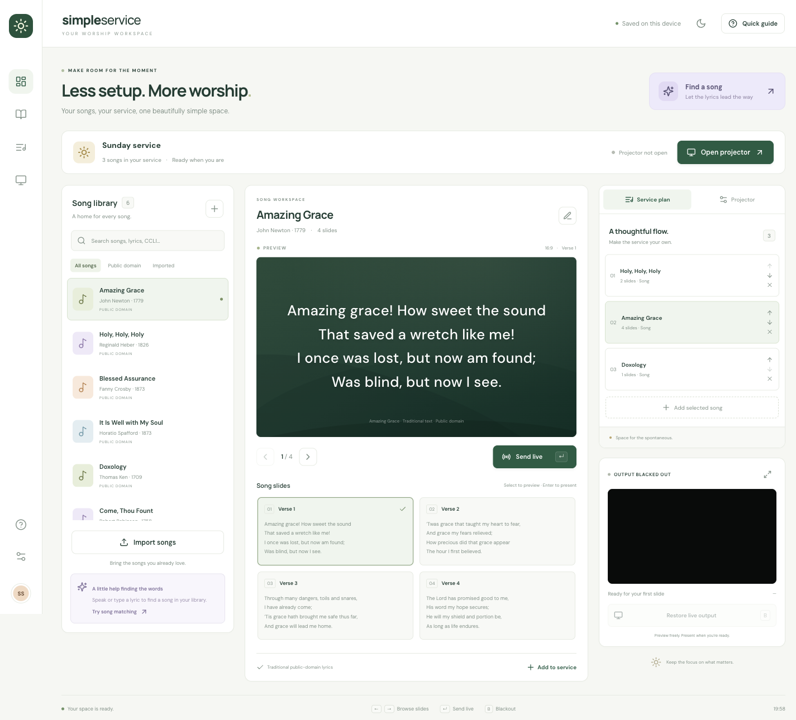

# Simple Service

A calm, colourful worship presentation workspace. Prepare songs, arrange a service, and send lyrics to a separate audience display.



## Run locally

Requires Node.js 22.12+ and npm.

```sh
npm ci
npm run dev
```

Open the address printed by Vite (normally http://127.0.0.1:5173). Use **Open projector**, move that window onto your projector, then choose **Enter fullscreen**. Keep the controller tab open. Use only one controller tab per browser profile.

```sh
npm test          # import and matching tests
npm run typecheck # check all application TypeScript
npm run build     # production files in dist/
npm run preview   # inspect a production build locally
```

The production build is a static site; serve `dist/` over HTTPS or localhost. Relative asset paths support deployment under a repository subdirectory. Fonts are bundled locally. This version is a web application, not a native desktop installer.

## What works

- Search song titles, authors, lyrics and CCLI song numbers; filter public-domain and imported songs.
- Six traditional public-domain starter hymns; create and edit songs and their credit details.
- Import review, duplicate detection, validation and per-file failure messages.
- Service name, ordered song list, reorder/remove controls and persistent local storage.
- Slide preview stays separate from the live output; click a slide to preview and **Send live** to present.
- Separate audience and stage windows. Stage shows the current and next slide.
- 16:9, 4:3 and 16:10 display formats; scalable text with automatic fitting; alignment; four slide backgrounds; copyright footer switch.
- Blackout / restore, light / dark workspace, responsive layout, keyboard controls and accessible modal focus handling.
- Microphone-assisted or typed lyric matching against the local song library. Suggestions never automatically change the audience display.
- Export library to JSON and import it on another device.

## Presenting

| Action                        | Shortcut           |
| ----------------------------- | ------------------ |
| Previous / next preview slide | Left / right arrow |
| Send preview to live output   | Enter              |
| Black out / restore output    | B                  |
| Close a dialog                | Escape             |

Keyboard shortcuts are inactive in forms and dialogs. Double-clicking a slide presents it immediately. Display settings apply to the live screen as they change. If the controller stops broadcasting for five seconds, the audience window goes black. Browser timer throttling or a suspended computer can also trigger that fail-safe; keep the controller active during a service.

A browser cannot reliably pick an attached projector or change its hardware resolution. Choose the aspect ratio here, then move the output window and configure display resolution in the operating system. The connection indicator confirms an open browser window, not a physical projector. Closing the audience window does not delete your currently selected live slide; reopening restores it.

## Song imports

| Format                                                             | Support                                                                                     |
| ------------------------------------------------------------------ | ------------------------------------------------------------------------------------------- |
| Plain text (`.txt`)                                                | First line is title; blank lines separate slides; optional Verse / Chorus / Bridge headings |
| OpenLyrics (`.xml`)                                                | Titles, authors, CCLI number, copyright, verses, line breaks and verse order                |
| OpenSong (`.xml`)                                                  | Title, author, copyright, CCLI number and bracketed verse headings; chord lines omitted     |
| Simple Service (`.json`)                                           | Exported library, song array, or individual song object                                     |
| EasyWorship / FreeWorship native databases or packed service files | Not supported directly; export to one of the supported formats, or paste lyrics             |

OpenLyrics rich inline formatting, translation alternatives and custom arrangements are not fully preserved. Preview imports before using them live. Imports accept up to 2,000 songs per file and 5 MB per file. Identical title/lyric imports are skipped; different arrangements remain separate.

Text example:

```text
My song title

Verse 1
First line of the verse
Second line of the verse

Chorus
First line of the chorus
Second line of the chorus
```

JSON example:

```json
{
  "songs": [
    {
      "title": "My song",
      "author": "Author name",
      "source": "My songs",
      "ccli": "",
      "copyright": "",
      "slides": [{ "label": "Verse 1", "text": "First line\nSecond line" }]
    }
  ]
}
```

## CCLI and recognition

CCLI song numbers and your church licence number are metadata, not authentication. Simple Service does not verify a licence, connect to the SongSelect catalogue, scrape lyrics, or report song usage. Use [SongSelect](https://songselect.ccli.com/) separately and import lyrics you are authorised to use. Starter songs use traditional texts rather than contemporary copyrighted arrangements.

Voice matching uses the browser's optional SpeechRecognition API. Availability, microphone permissions, internet connectivity and recognition quality depend on the browser/provider. Starting the microphone may send audio to the browser provider for processing. There is no app audio-recording store or recognition backend. This is **lyric matching, not melody or audio-fingerprint recognition**; speech usually works better than singing. The displayed percentage is word overlap, not a calibrated probability. Typed lyrics work without microphone access.

## Storage and privacy

Songs, display settings, service name and service song order are saved in this browser's local storage. There is no account, cloud sync or server database. Export a library backup before clearing browser data. A library backup contains songs only; it does not restore the service order or settings. Private browsing and full storage may prevent saving. Imported text is rendered as text, not HTML.

## References

- [OpenLyrics format](https://docs.openlyrics.org/en/latest/dataformat.html)
- [CCLI SongSelect](https://songselect.ccli.com/)
- [EasyWorship song management](https://support.easyworship.com/support/solutions/articles/24000020402-adding-and-editing-songs)

## Architecture

`src/library.ts` handles song validation, import, deduplication and lyric matching; `src/Projector.tsx` renders audience/stage windows; `src/App.tsx` contains operator flows; `src/seeds.ts` holds traditional starter songs. BroadcastChannel synchronises output across windows on the same origin. The interface and implementation were built afresh for this repository; no Rhema source code is included.
